# Game of Ur in Maya

**by Michael Stickler**

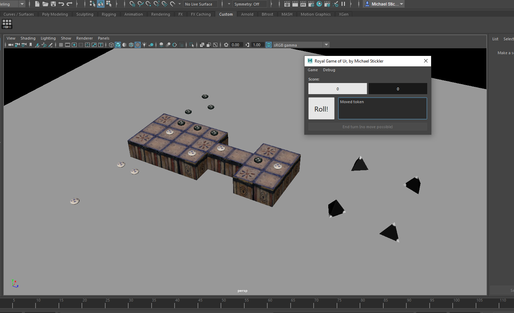

This is a recreation of my very first Python project. While learning the language, I created a playable board game
inside of Maya, based on the ancient Mesopotamian "Royal Game of Ur". I have revisited the idea and rebuilt it from scratch using some of the things I have learned in the past few years.

You can see the game being played [here](https://www.youtube.com/watch?v=WZskjLq040I)

This game uses API callbacks placed on automatically generated Maya objects to interact with the game code.

## Installation

1. Copy the whole GameOfUr folder (containing `__init__.py` and other files)


2. Paste it in `\Documents\Maya\MAYA_VERSION\scripts`


3. In Maya, from the python command line, type the following and hit Enter:
   ```python
    import GameOfUr
   ```

   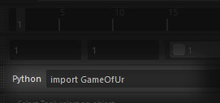


4. A window will pop up with a button to launch the game.
   > If no window appears, try entering the following instead:
   > ```python 
   > mgs_ur_show_launcher()
   > ```


5. You can drag this icon with the middle mouse, and drop it onto one of Maya's shelves to create a shortcut to launch
   the game.

   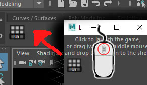

---

## Introduction

When the game is launched, some objects will be created in the Maya scene, and a window will pop up with game
information.

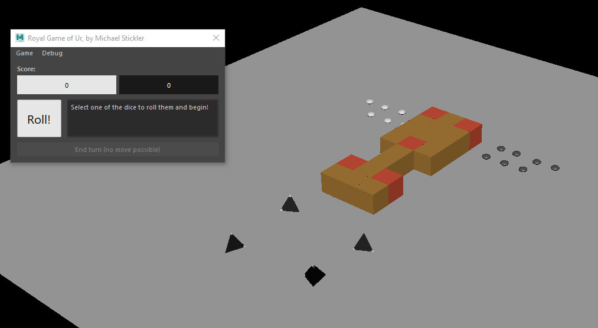

Make sure you have the viewport set to show textures. 

You interact with the game by selecting pieces, as you would any other object in Maya.

> (If you need to disable this temporarily, the "Debug" menu offers a toggle to turn the event on and off)


---

## How to play:

### Roll the dice

It is player 1's (White) turn first, select a die, or click on the "Roll!" button in the UI to roll the dice.

you can see whose turn it is by the colour of the "Roll" button/display: 
- White = Player 1
- Black = Player 2

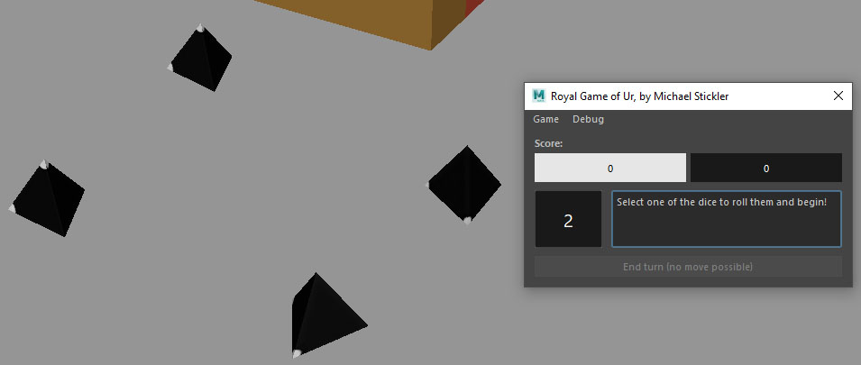

> In the Game of Ur, four 4-sided tetrahedron dice are traditionally used. These are not numbered like modern dice,
> but instead, two of the corners are painted with a white dot.
>
> When all four dice are rolled, count the number of white dots that point up,
> and move one of your pieces that many places. (in this version, counting is done automatically)

---

### Move a token

Your goal is to get all of your pieces round the board to the end. Each player has their own path, shown in the image
below. 

Along the middle row, both players share the same path, and can come into conflict.

The "Roll" button changes to show the value rolled on the dice. Select one of your pieces, and it will move that many
places along its path. (If it is possible to do so)

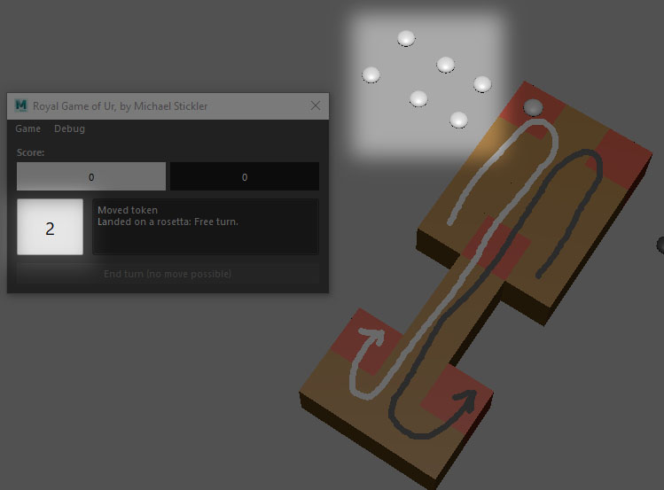

---

### Displacing opponents

If you can land on an opponent's piece (as long as that piece isn't on a "rosetta" tile)
you will take its place and send the other piece all the way back to the start, before it even joined the board.

You can't displace your own pieces.

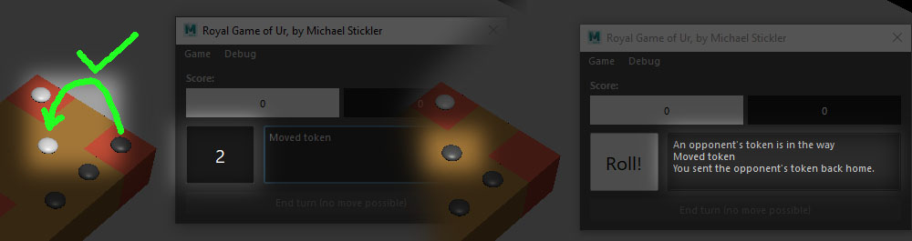

> This can only happen along the middle row, where both players are competing for space.
> On the other two rows, you are safe.

---

### Rosetta tile (Free turn)

There are five "rosetta" tiles on the board. Each player can access three of them.

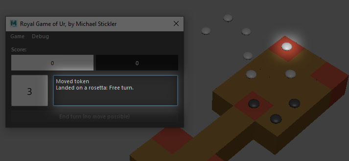

If one of your pieces lands on one of these tiles, there are two benefits:

- You get a free turn. You get to roll again and move another piece
- Your piece is protected if your oponent tries to send it back home, blocking them from moving to that tile.

  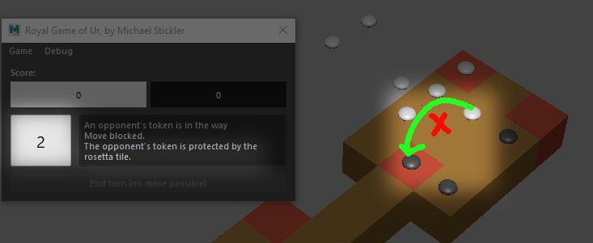

---

### The goal

The goal is to get all of your pieces all the way round the board. Each piece must land exactly one space after the last
tile in its path. If it would move further than that, the move is blocked.

Once a piece makes it here, it is removed from the board and added to your score.

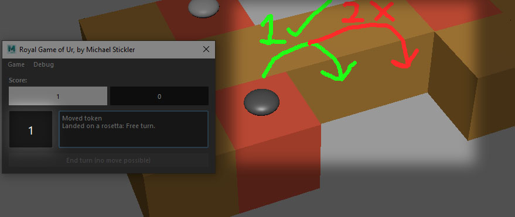

---

### Winning the game

When all of your pieces have reached the end, the winner will be announced, and you will be asked if you want to reset
the board and play again.

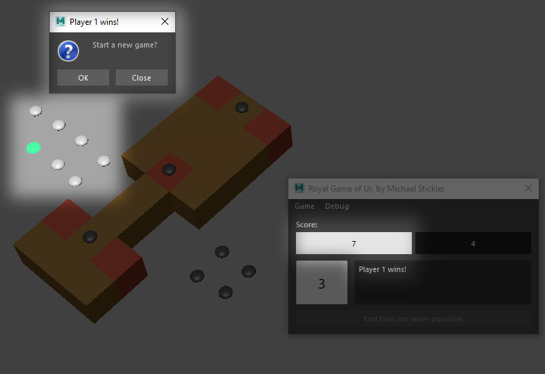

---

### Ending your turn

Your turn will end automatically once you finish your move, however sometimes you will be unable to move.

- Sometimes you will be unlucky and roll a zero.
  
  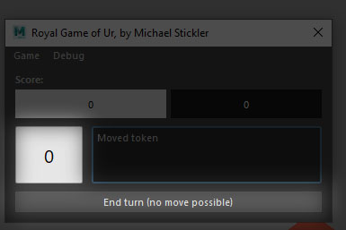


- Sometimes (usually near the end of the game) you will roll more than a zero, but all of your pieces are blocked for
  various reasons, meaning no move is possible
  
  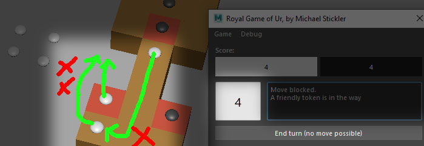


In either of these cases, there is nothing you can do, so the "End turn" button will be enabled. Click it to pass the
dice to the other player.

You cannot end your turn if any moves are possible. The "End turn" button is disabled as long as at least one move is
available. You have to make a move, even if you don't want to.

---

## Strategy

Not all dice rolls are equal. some values are more common than others.

Here are the chances of rolling each value:

|Roll value(s)|Chance|
|-------------|------|
|**0 or 4**| 1 in 16|
|**1 or 3**| 1 in 8|
|**2**| 1 in 4|

> This means you can strategise by choosing which piece to move each turn,
> positioning them in places that give you an advantage or give you the best chance of landing in a particular spot.

---

## Notes

- If the game window is closed, all of the game pieces/textures etc. will be deleted from Maya to clean up.
- You can start a new game at any time by going to **Game** > **New game**
- The debug menu gives you the ability to delete all objects from Maya, delete the event trigger, or temporarily disable
  the trigger (allowing you to select the game pieces without triggering game functions.)
